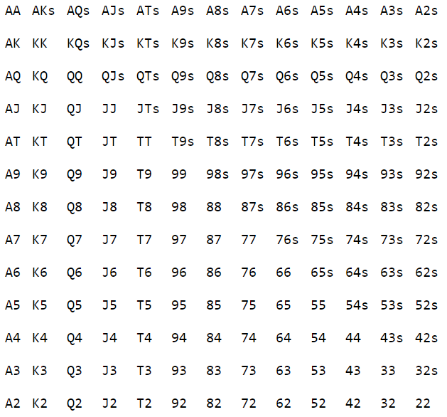

# HTML table of Poker Ranges Starting Hands Chart
A simple HTML table representation of all starting hands in Texas Holdem poker.

Similar to what you might find from poker equity calculators, solvers, etc.

May be useful for someone building a web-based application.

